update: 30.11.2025  

# Docker Demo Documentation

This document reports the steps we, [punnalathomas](https://github.com/punnalathomas) and [nlholm](https://github.com/nlholm), took while building :whale: **[Docker Demo](https://github.com/nlholm/docker-demo)**, a small-scale Infrastructure as Code (IaC) project built as the final task for a [Configuration Management Systems course](https://terokarvinen.com/palvelinten-hallinta/) run by Tero Karvinen.

We began by installing Docker and Nginx web server manually in a Vagrant environment, then automated the setup with Salt. Next, we installed Nginx as a load balancer — again, starting manually before moving to automation. Finally, we showcased how the fully automated load balancer distributed traffic to three web servers running inside Docker containers.

Throughout this process, we progressively added comments to our provision and configuration files to ensure clarity. We also documented the project's purpose and setup instructions in the project repository's README.md file. It is worth noting that while the final codebase is thoroughly documented, the earlier iterations in this documentation repository contain fewer comments and explanations.

We each worked approximately 20 hours on the project during the week of 24 - 30 November, 2025. 

# Installing Docker on Debian Bookworm64

First, we installed Docker manually on a clean Debian Bookworm64 virtual machine running in Vagrant. The environment came pre-installed with wget, curl, gnupg2, micro, and the Salt Master. We also added bash-completion to the VM. 

We also set up a custom Vagrantfile and dependent script files, which we iteratively updated to support automation throughout the project as we advanced. 

We logged in to our virtual machine through the Windows command line prompt with the command `vagrant ssh master`.  

Whilst inside the virtual machine - vagrant@master - we ran:

1. `sudo apt-get update`
2.  `sudo apt install ca-certificates curl`
3.  `sudo curl -fsSL https://download.docker.com/linux/debian/gpg -o /etc/apt/keyrings/docker.asc`
4.  `sudo chmod a+r /etc/apt/keyrings/docker.asc`
5.  `sudo tee /etc/apt/sources.list.d/docker.sources <<EOF Types: deb URIs: https://download.docker.com/linux/debian Suites: $(. /etc/os-release && echo "$VERSION_CODENAME") Components: stable Signed-By: /etc/apt/keyrings/docker.asc EOF`
6.  `sudo apt-get update`
7.  `VERSION_STRING=5:29.0.4-1~debian.12~bookworm`
8.  `sudo apt install docker-ce=$VERSION_STRING docker-ce-cli=$VERSION_STRING containerd.io docker-buildx-plugin docker-compose-plugin`
9.  `sudo systemctl status docker`  

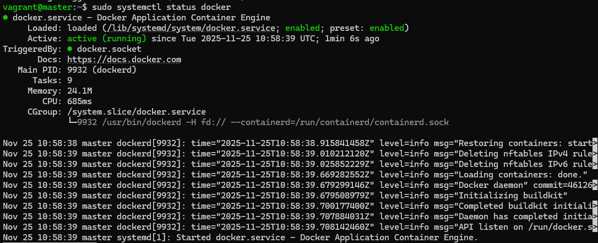  

And we had Docker running!  

We tried `sudo docker run hello-world`. The command downloads a test image, runs it in a container and sends a message that says that your installation has worked correctly (as explained by [Dockerdocs](https://docs.docker.com/engine/install/debian/#install-using-the-repository)).

## Automating Docker with Salt

We started automating Docker installation with Salt by creating a directory with path:/srv/salt/docker/ by giving the command `sudo mkdir -p /srv/salt/docker`. We also created an init.sls file inside of the directory (docker module).  

Version 1:

```
docker_dependencies:
  pkg.installed:
    - pkgs:
      - ca-certificates
      - curl
      - gnupg

/etc/apt/keyrings:
  file.directory:
    - mode: 0755

docker-gpg-key:
  cmd.run:
    - name: |
        curl -fsSL https://download.docker.com/linux/debian/gpg -o /etc/apt/keyrings/docker.asc && \
        chmod a+r /etc/apt/keyrings/docker.asc
    - unless: test -f /etc/apt/keyrings/docker.asc

/etc/apt/sources.list.d/docker.sources:
  file.managed:
    - contents: |
        Types: deb
        URIs: https://download.docker.com/linux/debian
        Suites: {{ grains['oscodename'] }}
        Components: stable
        Signed-By: /etc/apt/keyrings/docker.asc

docker_apt-update:
  cmd.run:
    - name: sudo apt-get update
    - onchanges:
      - file: /etc/apt/sources.list.d/docker.sources

docker_packages:
  pkg.installed:
    - pkgs:
      - docker-ce
      - docker-ce-cli
      - containerd.io
      - docker-buildx-plugin
      - docker-compose-plugin

docker_service:
  service.running:
    - name: docker
    - enable: True
```

We tried running the module in our minion virtual machine by giving the command `sudo salt 'minion1' state.apply docker` from the master.  

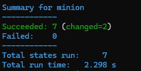 

Looks like it worked!  

We logged in to the minion to see if Docker ran there. 

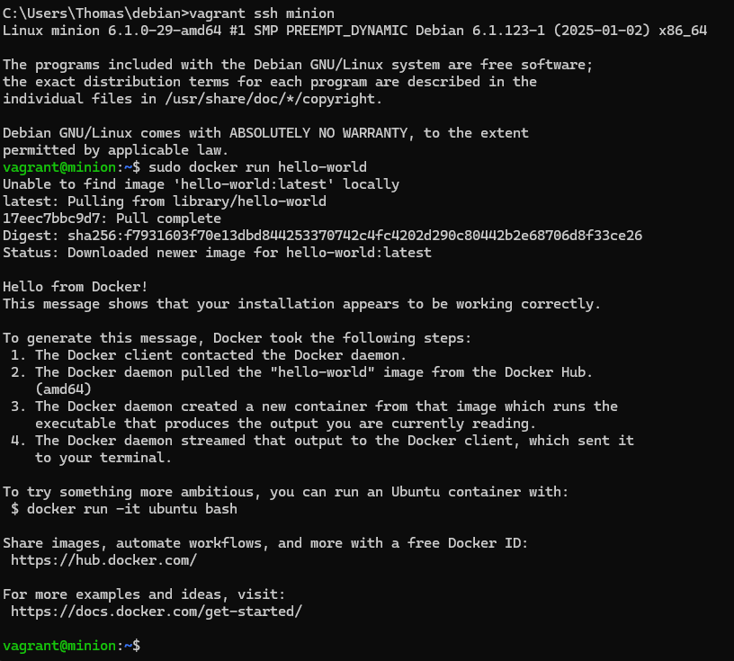  

We tried the command `sudo docker run hello-world` and it gave an answer. Our installation was working as planned.  

# Serving Static Website in an Nginx Container

We started the following phase of our project by installing Docker on our master. We had already automated the installation of Docker so we could run the salt command locally. `sudo salt-call --local state.apply docker` and now we had Docker in our master.  

Next we created a folder in our home directory for the docker compose file so we could set up multiple containers. We also included our index.html, styles.css and images subfolder in that directory. We ran the command `mkdir -p /home/vagrant/nginx-demo/site/images` (note -p for the full path).  

Then we created the docker-compose.yml file that sets up three nginx web servers.  

```
services:
  web1:
    image: nginx
    container_name: nginx-web1
    ports:
      - "8081:80"
    volumes:
      - ./site:/usr/share/nginx/html:ro
    restart: unless-stopped

  web2:
    image: nginx
    container_name: nginx-web2
    ports:
      - "8082:80"
    volumes:
      - ./site:/usr/share/nginx/html:ro
    restart: unless-stopped

  web3:
    image: nginx
    container_name: nginx-web3
    ports:
      - "8083:80"
    volumes:
      - ./site:/usr/share/nginx/html:ro
    restart: unless-stopped
```

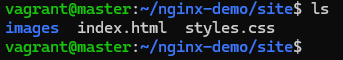  

We added our dependencies to the webpage.  

Now we had completed our nginx-demo directory and it was time to test it. We ran this command in the nginx-demo directory: `sudo docker compose up -d`.  

After that we ran the command `sudo docker ps` to see which containers were running and the command `curl localhost:8080` to see if our webpage was up and running.  

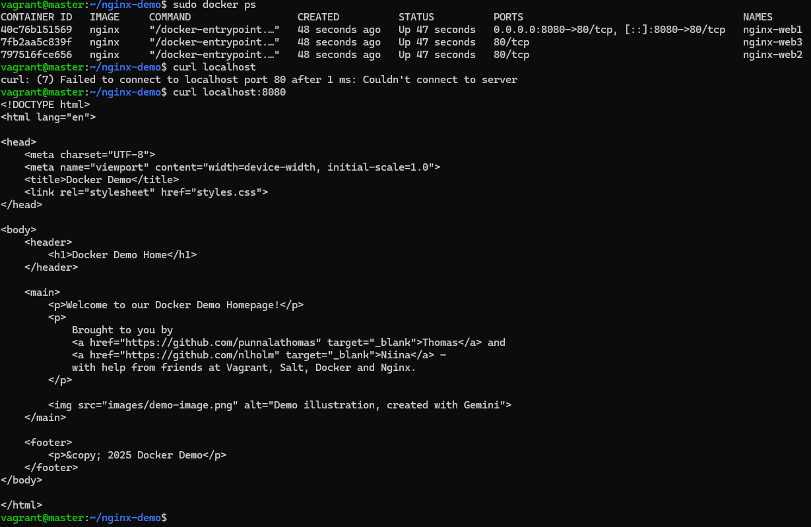  

As we can see we had three Nginx containers up and running and our webpage responded correctly.  

## Automating Nginx Web Server with Salt

We started automating the Nginx web service by creating a new directory nginx-web under /srv/salt/. First, we copied all the files that we used before to build our module.  

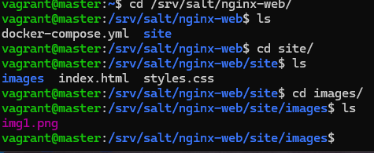  

Then we created an init.sls file inside the  nginx-web module.  

```
/home/vagrant/nginx-demo:
  file.directory:
    - user: vagrant
    - group: vagrant
    - mode: 755

/home/vagrant/nginx-demo/docker-compose.yml:
  file.managed:
    - source: salt://nginx-web/docker-compose.yml
    - user: vagrant
    - group: vagrant
    - mode: 644
    - require:
      - file: /home/vagrant/nginx-demo

/home/vagrant/nginx-demo/site:
  file.recurse:
    - source: salt://nginx-web/site
    - user: vagrant
    - group: vagrant
    - file_mode: 644
    - dir_mode: 755
    - require:
      - file: /home/vagrant/nginx-demo

nginx_web_up:
  cmd.run:
    - name: docker compose up -d
    - cwd: /home/vagrant/nginx-demo
    - require:
      - file: /home/vagrant/nginx-demo/docker-compose.yml
      - file: /home/vagrant/nginx-demo/site
    - unless: "docker ps --format '{{.Names}}' | grep -q nginx-web1"
```

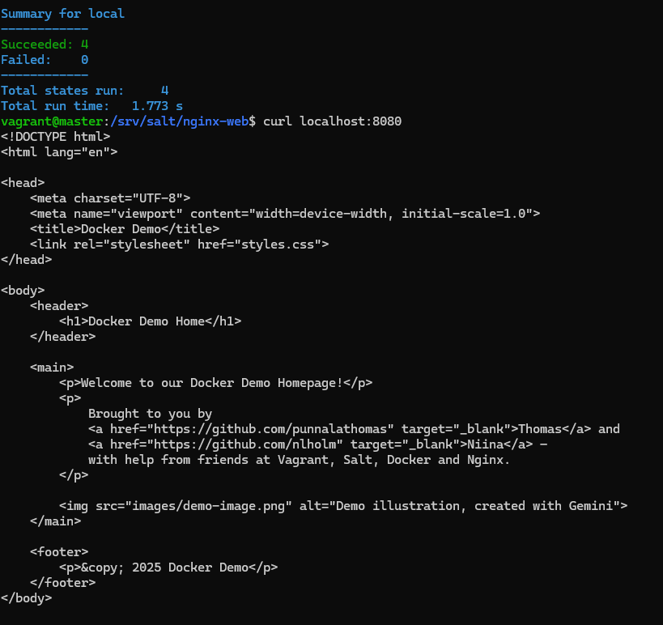  

`sudo salt-call --local state.apply nginx-web` and the automated version of the Nginx web service was running on the master!  

## Testing

After adding a top.sls file into our /srv/salt/ path, we tried to run our two modules - docker and nginx-web - as Salt states in the minion. We ran the command `sudo salt 'minion1' state.apply` in our master.  

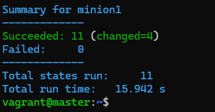  

The Highstate was applied successfully. We ran the command twice and got a "succeeded: 11 (changed=0)" message, so our environment was idempotent, as intended. 

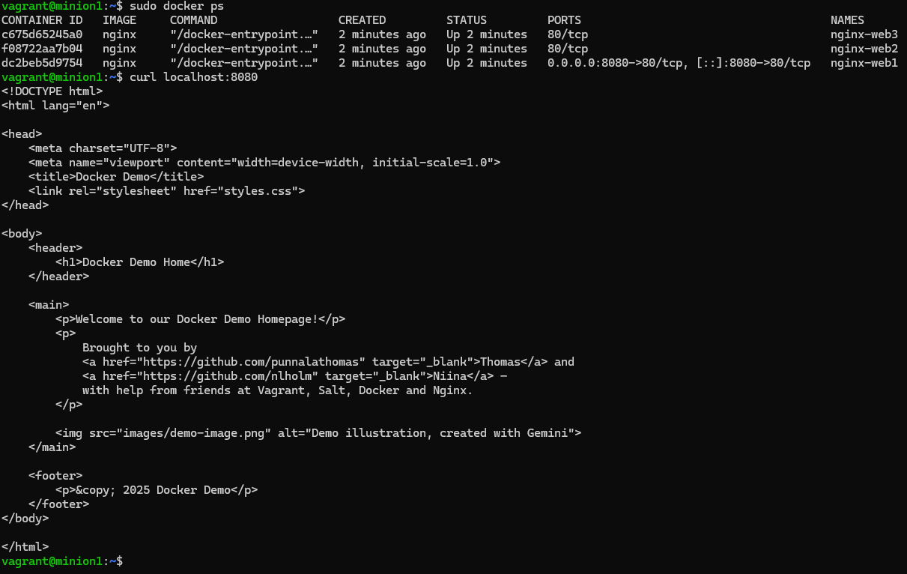  

We logged in to our minion and saw that we had a webpage available at localhost:8080.  

# Nginx as Proxy and Load Balancer

In the final stage of our project, we further utilized Nginx and installed it as a reverse proxy and load balancer that serves our three backend web servers that run in Docker containers.  

Once again, we started the installation without automation first. We ran  `sudo apt-get update` , `sudo apt install nginx` on the master. 

After installation we worked on the nginx.conf that was available at /etc/nginx/nginx.conf.

```
worker_processes 1;


events {

}


http {
        include mime.types;

        upstream container_cluster {
                server 127.0.0.1:8081;
                server 127.0.0.1:8082;
                server 127.0.0.1:8083;
        }

        server {

                listen 80;
                server_name localhost;

                location / {

                        proxy_pass http://container_cluster;
                        proxy_set_header Host $host;
                        proxy_set_header X-Real-IP $remote_addr;

                }

        }

}

```

We put in place the following configuration:  
1. Worker processes are set to one, meaning Nginx uses a single operating system process to handle all incoming connections.
2. Upstream acts as load balancer. Default is round robin, so it will pick one server at a time to send the request to.
3. Location acts as reverse proxy. It will get the request from the client and forward it to our servers.
4. Nginx listens on port 80 and serves the localhost address.

## Testing

First we shut down our containers with the command `sudo docker compose down` and brought them back up with the command `sudo docker compose up -d`. Also, we just made changes to the  /etc/conf file so we restarted the nginx daemon with the command `sudo systemctl restart nginx`.  

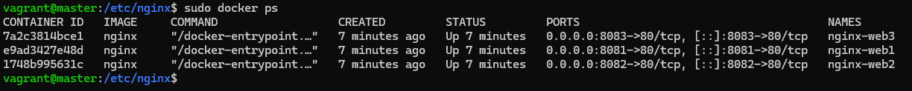  

Localhost answered with the desired webpage in every port. `curl localhost` also delivered the same page, so the reverse proxy seemed to be working.  

Next, we verified the load balancer configuration.  

We ran 30 HTTP requests to Nginx:  

```
for i in {1..30}; do
  curl -s http://localhost/ > /dev/null
done
```

Then we checked in the container logs the number of GET requests handled by each container:

```
sudo docker logs nginx-web1 | grep "GET / " | wc -l
sudo docker logs nginx-web2 | grep "GET / " | wc -l
sudo docker logs nginx-web3 | grep "GET / " | wc -l
```

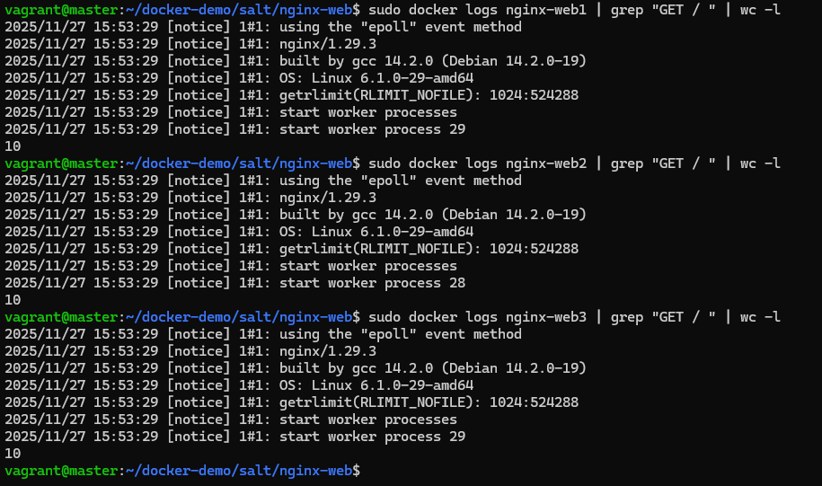  

As we can see, each container (web server) handled 10 requests. Load balancing was working as intended. 

## Automating Nginx Proxy and Load Balancer with Salt

We created a new Salt module called nginx-proxy on the master, srv/salt/nginx-proxy. We created an init.sls file in the module: 

```
nginx_pkg:
  pkg.installed:
    - name: nginx

/etc/nginx/nginx.conf:
  file.managed:
    - source: salt://nginx-proxy/nginx.conf
    - user: root
    - group: root
    - mode: 644

nginx_service:
  service.running:
    - name: nginx
    - enable: True
    - watch:
      - file: /etc/nginx/nginx.conf
```

We copied the nginx.conf file into the module directory. We also added the module into the top.sls file, at the root of the /srv/salt path. 

Now we were ready to test the Highstate by running `sudo salt 'minion1' state.apply`. 

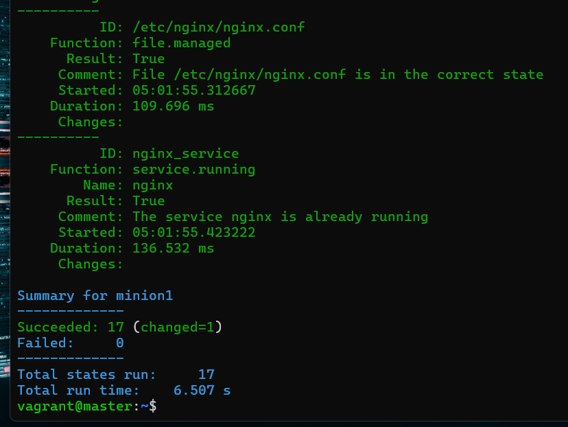

Success: we installed the Nginx load balancer on the minion, to handle traffic into the three Nginx web servers running in Docker containers, also on the minion (the screnshot represents a situation after running the state more than once).

We stored our work into our remote project repository, under the salt folder there. https://github.com/nlholm/docker-demo/tree/main/salt

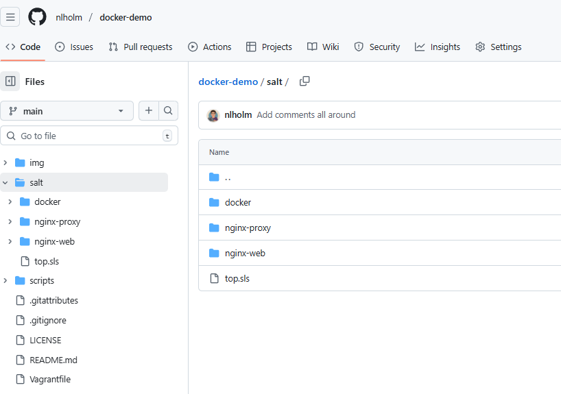 

State modules as stored in the online repository.

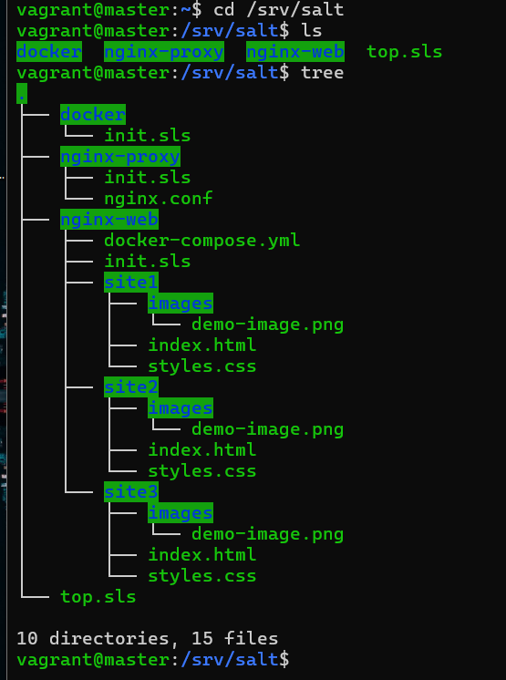 

State modules as shown on the /srv/salt path of the master.

# Testing the Project as a Whole

We started testing the finalized architecture by provisioning a clean Vagrant environment. On the host, we navigated to the project folder that contains the Vagrantfile. We ran `vagrant up` , and, once the environment was provisioned, we connected via SSH to the master, `vagrant ssh master`. 

We cloned the project repository onto the master. `git clone https://github.com/nlholm/docker-demo.git`.  

We created a folder for Salt. `sudo mkdir -p /srv/salt`.  

We copied the cloned modules into /srv/salt/. `sudo cp -r docker-demo/salt/* /srv/salt/`.

(Note: The Vagrantfile has sive been updated to automatically symlink the Salt project folder from the host to the master. Therefore, manually cloning the repository or copying files to the master is no longer necessary, as described in the Vagrantfile comments.)

We ran the Highstate (top file) on the master: `sudo salt 'minion1' state.apply`.   

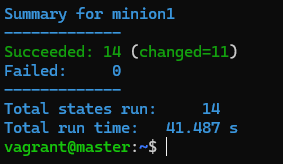 

All good so far! 14 states succeeded, 11 changes.

We signed off the master and onto the minion.

```
exit
vagrant ssh minion1
```

## Containers and Web Servers

We ran some tests on the minion:

`sudo systemctl status docker`  
`sudo systemctl status nginx`  
`sudo docker ps`  

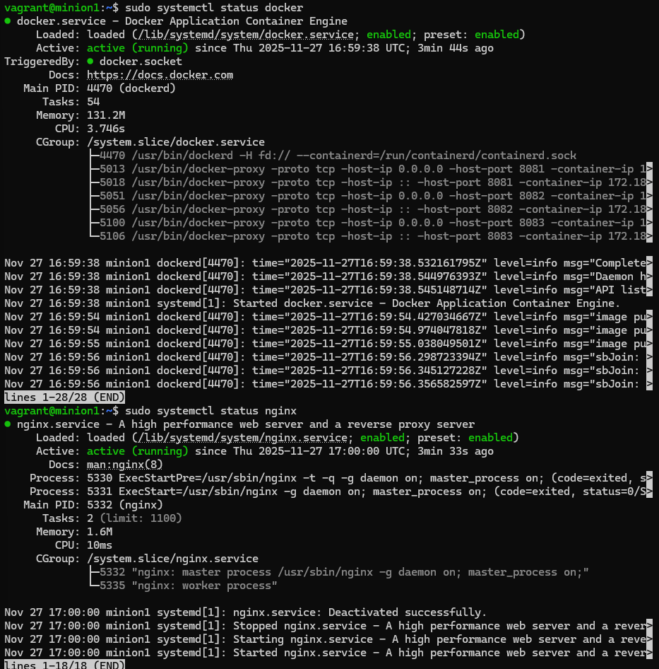  

Both services, Docker and Nginx were active and running. 

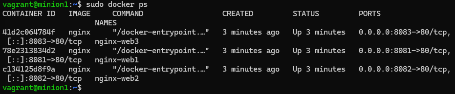  

All three Nginx containers were running the same web server and listening on port 80 within their container. 

In Docker, the internal ports of containers can be identical (e.g., port 80). However, at the Docker host level (the minion), these ports must be differentiated to avoid conflicts.

For this reason, the containers are mapped on the minion as follows: 

nginx-web1 → Host 8081 → Container 80/tcp

nginx-web2 → Host 8082 → Container 80/tcp

nginx-web3 → Host 8083 → Container 80/tcp

The Nginx proxy acts as both a reverse proxy and a load balancer. It directs incoming traffic to the host ports (8081–8083), from where Docker forwards the traffic to port 80 inside each respective container.

The end result is that a single Nginx proxy (listening on port 80) successfully distributes traffic to three distinct backend Nginx web server containers.

## Website

`curl localhost`  

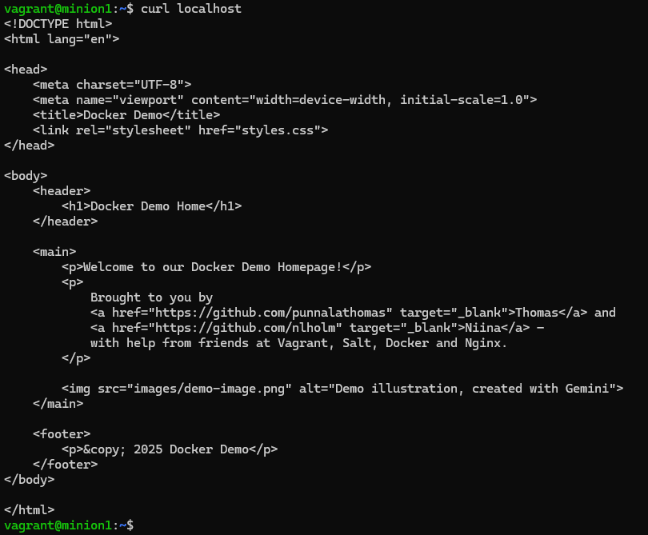  

`curl` was successful on the localhost, from which we can conclude that the proxy works as intended.

To add a visual effect on our demo, we updated the Vagrantfile to include port forwarding. By forwarding Host 8080 -> Guest Load Balancer 80, we are allowed to access the load balancer from a host browser at http://localhost:8080. `minion.vm.network "forwarded_port", guest: 80, host: 8080, auto_correct: true`. 

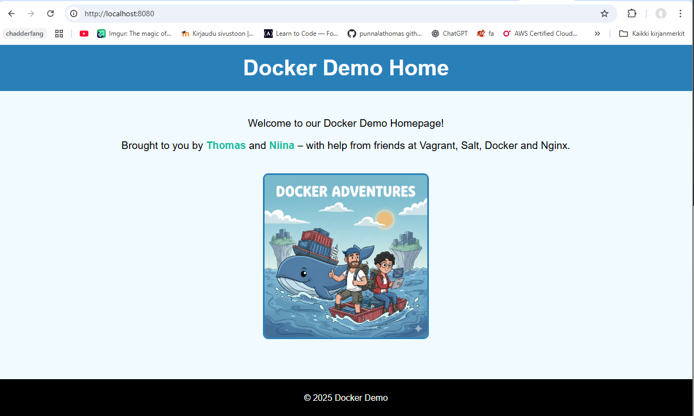  

http://localhost:8080 on the host machine's browser. We see a website served by Nginx running in a container! NB this is not the final version of the website.

## Load Balancer

We ran 30 HTTP requests to the Nginx proxy:

```
for i in {1..30}; do
  curl -s http://localhost > /dev/null
done
```

We had a look at the number of requests received by each container. `echo "web1: $(sudo docker logs nginx-<name of the container> | grep 'GET / ' | wc -l) pyyntöä"` 

  
  
  

As we can see, the load was distributed rather evenly between the web servers.

# Enhancing the Demo

In our project, we successfully showcased Infrastructure as Code (IaC) with a focus on idempotency. We created an environment that can be fully destroyed (`vagrant destroy`) and rebuilt (`vagrant up`) in minutes. The entire architecture — a load balancer distributing traffic to three containerized web servers — can be provisioned idempotently with a single command: `sudo salt 'minion1' state.apply`.

To improve the visual demonstration, we customized the deployment: instead of serving identical content, we mounted slightly different versions of the website into each container. The varying background colors (Blue, Pink, and Yellow) provide immediate visual verification that the load balancer is effectively distributing traffic.

Prior to finalizing the project, we refined the provisioning and configuration files. This included adding detailed comments to explain command logic and optimizing the Vagrantfile to ensure the virtual machines were allocated sufficient resources to handle the expected workload.

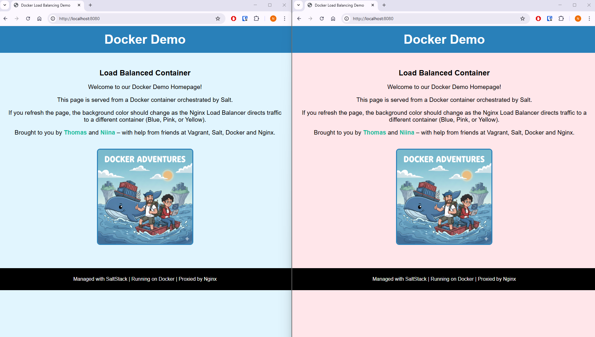

Load balancer in action in the localhost.

## References

Dockerdocs. Install Docker Engine on Debian. URL: https://docs.docker.com/engine/install/debian/#install-using-the-repository. Accessed: 25.11.2025  

Karvinen, T. 2025. Palvelinten Hallinta. https://terokarvinen.com/palvelinten-hallinta/

Manandhar, G. 2024. How to use Nginx with Docker Compose effectively with examples. URL: https://geshan.com.np/blog/2024/03/nginx-docker-compose/. Accessed: 25.11.2025  

TechWorld with Nana. Full NGINX Tutorial - Demo Project with Node.js, Docker. URL: https://www.youtube.com/watch?v=q8OleYuqntY&t=3980s. Accessed: 25.11.2025 

*ChatGPT and Gemini LLMs were utilized to finetune commenting on the provision and configuration files and to draw diagrams. LLMs were utilized to produce the html web sites. LLMs were also utilized to enhance translations from Finnish to English.*
